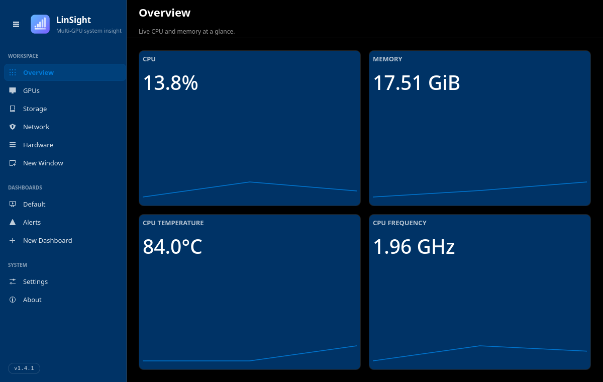
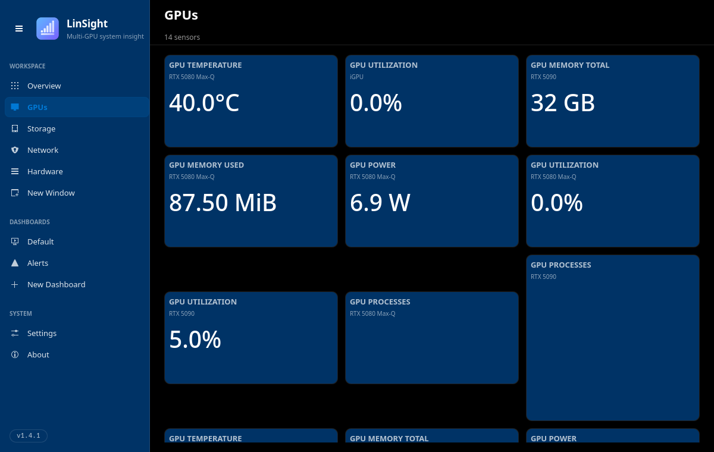
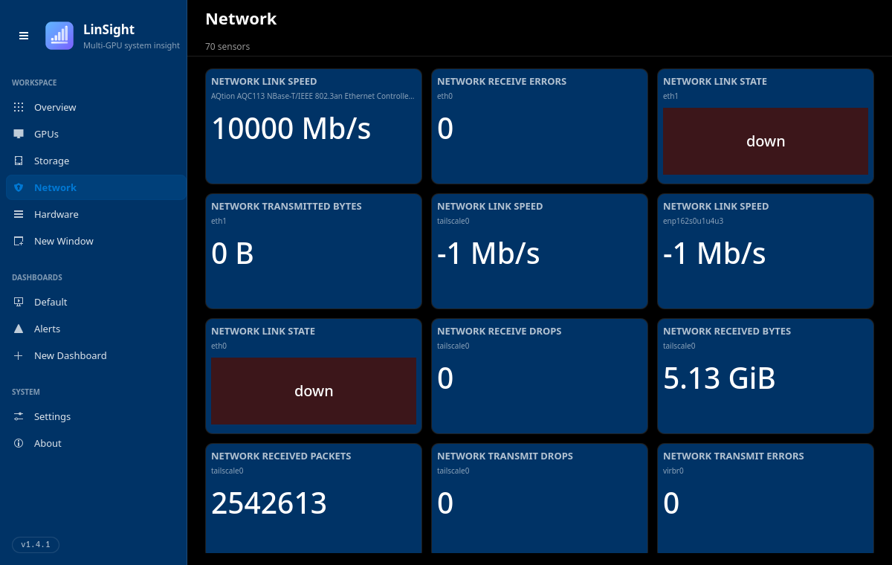
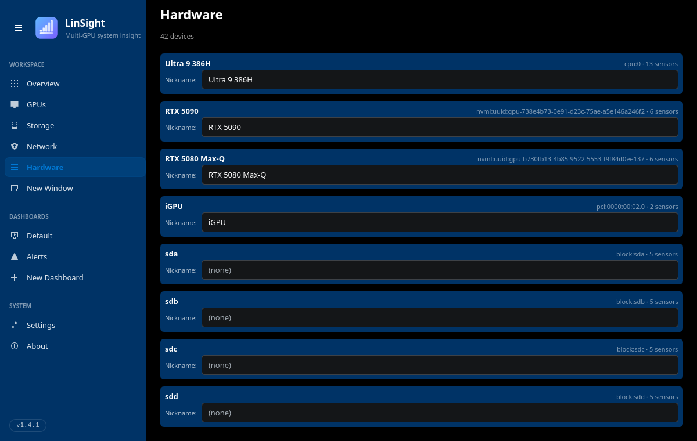

<!-- SPDX-FileCopyrightText: 2026 VisorCraft LLC -->
<!-- SPDX-License-Identifier: GPL-3.0-only -->

<p align="center">
  
</p>

<h1 align="center">LinSight</h1>

<p align="center">
  <b>The fast, modular Linux system-monitoring dashboard.</b>
  <br />
  Watch CPU, memory, multi-GPU, storage, network, and sensors — live, in one place.
  <br />
  Rust core · Qt 6 / Kirigami UI · CLI + GUI · runtime <code>.so</code> plugins · mTLS remote · no telemetry · GPL-3.0-only.
</p>

<p align="center">
  <a href="https://github.com/visorcraft/LinSight/releases/latest"></a>
  <a href="LICENSE"></a>
  
  
  
</p>

---

## Screenshots

<p align="center">
  
  <br />
  <em>Overview: live CPU, memory, temperature, and frequency at a glance.</em>
</p>

<table>
  <tr>
    <td width="50%" valign="top">
      
      <br />
      <em>Multi-GPU: NVIDIA, AMD, and Intel (xe + i915) side by side.</em>
    </td>
    <td width="50%" valign="top">
      
      <br />
      <em>Network: per-interface link speed, state, and throughput.</em>
    </td>
  </tr>
  <tr>
    <td width="50%" valign="top">
      
      <br />
      <em>Hardware: every device, with editable per-device nicknames.</em>
    </td>
    <td width="50%" valign="top">
      <p><em>Screenshots are captured by <code>./scripts/dev_screenshot.sh &lt;page&gt;</code>, which drives LinSight's own <code>QQuickWindow::grabWindow()</code> path so the frame is independent of compositor focus.</em></p>
    </td>
  </tr>
</table>

---

## What is LinSight?

LinSight answers the everyday "what is my machine doing right now?"
question. It samples your hardware and kernel and shows it back to you
live — as tiles you can rearrange, a scriptable CLI, or a Prometheus feed.

It is built around three goals:

- **Linux-native and low-overhead.** A pure-Rust daemon with **no async
  runtime in the hot path** (sync + `polling` only), sampling on demand
  and serving clients over a postcard-framed Unix socket.
- **Multi-GPU first.** First-class sensors for NVIDIA (NVML), AMD
  (amdgpu), and Intel (xe + i915) GPUs — temperature, utilization,
  memory, power, and processes, per device.
- **Extensible and scriptable.** Everything the GUI shows is also a
  `linsight-cli` subcommand, and new metric sources drop in as runtime
  `.so` plugins (ABI v6) without recompiling the daemon.

What it monitors today:

- **GPUs:** NVIDIA, AMD, and Intel (xe + i915), with per-device nicknames.
- **System:** CPU, memory, NVMe, disk, filesystem, network, hwmon, ZRAM,
  processes, systemd units, and PSI / load / uptime.
- **Runtime plugins:** drop a `.so` in to add sensors; the bundled
  sensors are themselves in-tree plugins. Per-plugin TOML config.
- **Custom dashboards & themes:** preset pages (Overview / GPUs /
  Storage / Network / Hardware) plus a drag-and-drop canvas editor.
- **Alerts:** `evalexpr` rules with an `exec:<argv>` notifier (no shell
  injection).
- **History & metrics:** optional SQLite history and a Prometheus
  exporter with a stable `device_key` label.
- **Remote:** an mTLS bridge (`linsight-tunnel`) for non-SSH topologies.

See [`CHANGELOG.md`](CHANGELOG.md) for the full per-release history.

---

## Try it

**GUI**

```bash
cargo run -p linsight
# Kirigami window with a left sidebar:
#   Workspace → Overview / GPUs / Storage / Network / Hardware / Editor
#   System    → Settings / About
# Auto-spawns linsightd as a child if no daemon is running.
```

Keyboard shortcuts: `Ctrl+1..5` for the workspace pages, `F1` for
About, `StandardKey.Preferences` for Settings.

**CLI**

```bash
just run-daemon                     # or let the GUI spawn it
just run-cli list                   # sensor catalogue (52+ entries)
just run-cli read cpu.util --count 5
just run-cli read mem.used_bytes --count 3
just run-cli plugin new my-sensor   # scaffold a third-party plugin
```

**Remote (mTLS, non-SSH topologies)**

```bash
# On the remote machine running linsightd. Default bind is
# 127.0.0.1:9443; pass --bind 0.0.0.0:9443 to expose to the network.
linsight-tunnel server \
  --bind 0.0.0.0:9443 \
  --cert server.pem --key server.key --ca clients-ca.pem \
  --socket /run/user/1000/linsight.sock

# On your desktop:
linsight-tunnel client \
  --listen $XDG_RUNTIME_DIR/linsight-remote.sock \
  --server remote.host.example:9443 \
  --cert client.pem --key client.key --ca server-ca.pem
```

Any LinSight client then connects to the local socket as usual; bytes
are piped over mTLS to the remote daemon. See
[`apps/linsight-tunnel/README.md`](apps/linsight-tunnel/README.md) for a
topology diagram, an openssl cert recipe, and the trust-model caveats.
For most remote use, an SSH-forwarded socket
(`ssh -L $XDG_RUNTIME_DIR/linsight.sock:remote-runtime/linsight.sock host`)
is simpler and equally secure.

---

## Build

LinSight is a standard Cargo workspace (resolver 3, edition 2024, stable
Rust pinned via `rust-toolchain.toml`). Everything goes through `just`;
direct `cargo` invocations are equivalent if `just` isn't installed.

```bash
just ci              # fmt-check + clippy -D warnings + tests (the CI gate)
just build           # debug
just build-release   # release: lto=fat, codegen-units=1, strip
just build-release-v3   # x86_64-v3 tuned (CachyOS / modern systems)
```

Optional preflight (install with
`cargo install cargo-deny cargo-audit cargo-about`):

```bash
just preflight       # ci + deny + audit
just credits         # cargo about generate → docs/third-party-notices.md
```

---

## Install

Install LinSight as a **pacman-tracked package** rather than hand-copying
binaries into `/usr/`. For local development, build the working tree and
install it via pacman:

```bash
cd packaging/arch
makepkg -si -p PKGBUILD.local        # build the working tree, install via pacman
```

| Target            | Command                                              |
| ----------------- | ---------------------------------------------------- |
| Arch (local dev)  | `makepkg -si -p packaging/arch/PKGBUILD.local`       |
| Arch (release)    | `makepkg -si -p packaging/arch/PKGBUILD` (from a tag)|

`PKGBUILD.local` lays down the binaries, desktop entry, metainfo, the
user systemd unit, hicolor icons, and `/usr/lib/linsight/plugins`.
Manage it like any package — `pacman -Qi linsight` to inspect,
`sudo pacman -R linsight` to remove.

---

## Always-on mode (opt-in)

`packaging/systemd/linsight.service` is a systemd **user** unit. Enable
it once to keep the daemon resident; the GUI / CLI then attach to the
existing socket. Always-on mode also gates the optional surfaces —
history (`LINSIGHT_HISTORY`), alerts (`LINSIGHT_ALERTS`), and the
Prometheus exporter (`LINSIGHT_PROM_BIND`), all off by default. The
Settings page shows each subsystem's env-var status.

---

## Architecture

- **`apps/linsightd/`** — daemon; hosts plugins, schedules
  subscription-driven sampling, serves clients over a postcard-framed
  Unix socket. Optional history (SQLite), alerts (evalexpr), Prometheus
  exporter.
- **`apps/linsight-gui/`** — Qt 6 / Kirigami GUI via cxx-qt 0.8. Sidebar
  shell, preset pages, canvas editor, multi-window. Auto-spawns the
  daemon if none is listening.
- **`apps/linsight-tunnel/`** — mTLS bridge for the daemon socket
  (`server` / `client` subcommands; transparent byte pipe). The only
  binary that uses tokio — never the daemon hot path.
- **`crates/linsight-core/`** — shared types and dashboard model (no I/O).
- **`crates/linsight-protocol/`** — postcard wire format + framing.
- **`crates/linsight-plugin-sdk/`** — public `LinsightPlugin` trait +
  `export_plugin!` macro. ABI v6 uses R-mirror types on the FFI boundary
  for cross-rustc safety; see
  [`docs/adr/0001-plugin-abi-stabby-deferral.md`](docs/adr/0001-plugin-abi-stabby-deferral.md).
- **`crates/linsight-sensors/*`** — one in-tree plugin per hardware
  family / metric source (cpu, mem, net, nvme, nvml, xe, amdgpu, i915,
  disk, fs, hwmon, proc, system, systemd, zram).
- **`crates/linsight-cli/`** — `list` / `read` / `plugin {new, install,
  ls, remove}`.
- **`examples/echo-plugin/`** — minimal third-party plugin built as a
  `cdylib`; exercised by the SDK's `tests/dynamic_load.rs`.

See [`docs/architecture.md`](docs/architecture.md) for the full process
model and data flow.

---

## Contribute

Patches, bug reports, and design feedback are welcome. The full guide —
fork → branch → PR flow, coding standards, and commit style — lives in
[`CONTRIBUTING.md`](CONTRIBUTING.md). Quick rules of thumb:

- Branch from `master`, send a PR.
- Run `just ci` locally before pushing — it must pass (it's the same
  gate CI runs).
- LinSight is GPL-3.0-only; new dependencies must use a license in
  `deny.toml`'s allowlist.

Bugs / feature requests:
[GitHub issues](https://github.com/visorcraft/linsight/issues).

---

## Documentation

- [Architecture](docs/architecture.md)
- [Plugin ABI ADR-0001](docs/adr/0001-plugin-abi-stabby-deferral.md)
- [Remote tunnel](apps/linsight-tunnel/README.md)
- [Security](docs/security.md)
- [Changelog](CHANGELOG.md)
- [Third-party credits](docs/third-party-notices.md)

---

## License

GPL-3.0-only. See [`LICENSE`](LICENSE). Third-party license credits live
in [`docs/third-party-notices.md`](docs/third-party-notices.md).
